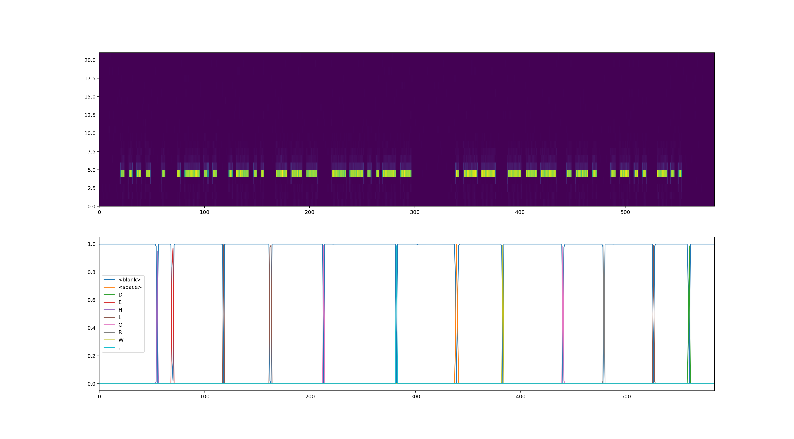

# Decode morse code using a neural network
Use a neural network to decode morse code! The input is preprocessed by taking the FFT in 20 ms windows. These inputs go into a few dense layers followed by an LSTM. The network does not use time based convolutions on the input, so it can be used in a streaming fashion before all the audio is available.

# Training
Run `./main.py`. Open tensorboard to view progess. The network will converge after a few thousand epochs.

The training uses a realistic morse code generator. It will simulate different speeds, frequency, noise levels and inconsistencies in timing. See `morse.py` for more details.

# Test
Run `./decode_audio.py --model models/001750.pt audio/hello_world.wav`. This will print the prediction, and show a plot of the spectrogram and tokens as predicted by the model.

